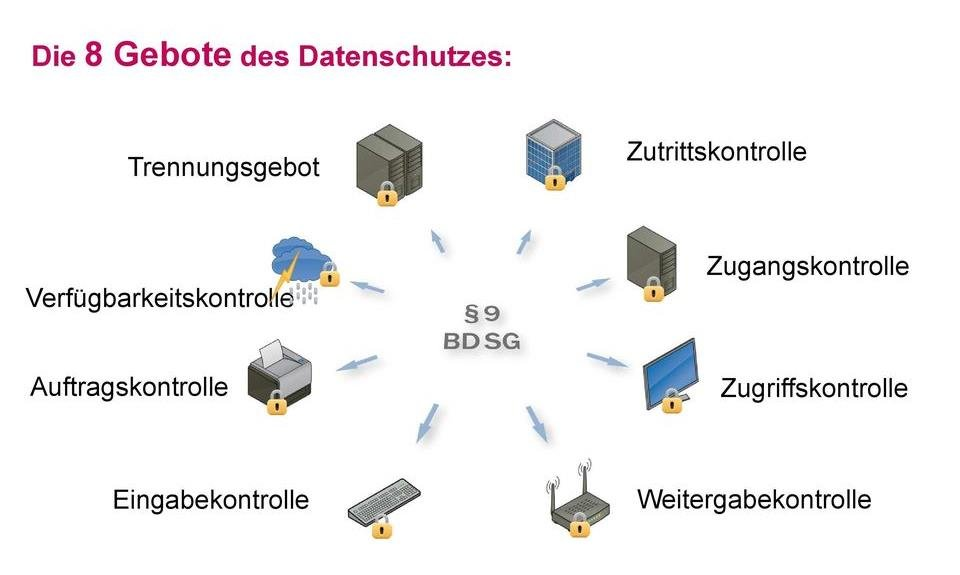

In der letzten TTI Vorlesung hat ein Fachanwalt für IT Recht einen Vortrag über "Rechtliche Aspekte des Cloud-Computing" gehalten.
Die Punkte aus dem Vortrag, die mir am wichtigsten sind, will ich hier einmal aufführen.
Dabei ging es um das Vertragsrecht, Datensicherheit, Datenschutz und zum Schluss einer Checkliste zum Cloud-Computing.
<!--more-->

Zusätzlich sei gesagt, man sollte sich nicht auf die Informationen in diesem Blog Post verlassen, ich bin kein IT Rechtsspezialist, ich bin Informatikstudent der einen Vortrag zu dem Thema in einer Vorlesung (\*hust\* [TTI]()) gehört hat.

# Vertragsrecht

Begonnen wurde der Vortrag mit dem Vertragsrecht.
Die 3 Vertragsformen Mietvertrag, Dienstvertrag und Werkvertrag wurden kurz erläutert:
Ein **Mietvertrag** stellt die simpelste Form eines Vertrages dar.
Der Kunde kann etwas nutzen, kann aber keine Ansprüche auf Funktionalität stellen.
Ein **Dienstvertrag** ist dort schon etwas besser für den Kunden, da er bestimmte Kriterien zugesichert bekommt.
So zum Beispiel eine bestimmte Bandbreite oder Rechenleistung.
Die beste Variante für den Kunden ist der **Werkvertrag**.
In diesem wird dem Kunden ein Ziel versprochen, das erfüllt werden muss, wie beispielsweise eine Implementierung einer Software.

| Beispiel | Vertragsform |
| --- | --- |
| Zugriff auf Hardware-Umgebung und Speicherplatz (IaaS) | Mietvertrag |
| Zugriff auf Laufzeit- und Entwicklungsumgebung (PaaS) | Mietvertrag |
| Nutzung von Software auf Server (SaaS) | Mietvertrag |
| Bereitstellung bestimmter Bandbreite | Dienstvertrag |
| Pflege, Weiterentwicklung, Aktualisierung von Software | Dienstvertrag |
| Bereitstellung von Rechenleistung | Dienstvertrag |
| Überwachungs- und Betriebsleistungen | Dienstvertrag |
| Installation, Implementierung, Anpassung von Software | Werkvertrag |
Vertragsformen aus dem Vortrag von Dr. Hans M. Wulf in der Vorlesung

## Wichtige Vertragsinhalte

- Vertragsgegenstand (SaaS, PaaS, IaaS)
- Leistungsbeschreibung (Verfügbarkeit, Services vgl. Vertragsformen)
- Change Management
- Service Levels (Support-, Reaktions- und Wiederherstellungszeiten) mit Vertragsstrafregelung
- Einsatz von Subunternehmern
- Vergütung
- Mitwirkungspflichten
- IT-Sicherheitsmaßnahmen (vgl. auch § 9 BDSG)
- Laufzeit
- Gewährleistung, Haftung

# Datensicherheit & Datenschutz

Bei den 8 Geboten nach §9 BDSG handelt es sich um die Angaben, in der die ergriffenen Maßnahmen zur Sicherung der Datenverarbeitung personenbezogener Daten beschrieben werden sollen.

Aus dem Vortrag von Dr. Hans M. Wulf in der Vorlesung

Um die 8 Gebote kurz durchzugehen, beginne ich oben rechts im Bild und fahre im Uhrzeigersinn fort.

Die **Zutrittskontrolle** sagt aus, Orte an denen personenbezogene Daten verarbeitet oder genutzt werden, physisch vor dem Zutritt Unbefugter zu schützen.
(Die Serverraum Tür soll eigentlich abgeschlossen sein, ist aber immer offen. Und falls sie zu ist, der Schlüssel hängt am Türschild.)

Mit der **Zugangskontrolle** ist der digitale Schutz vor dem Zugriff Unbefugter gemeint, wie zum Beispiel mit Passwörtern.
([xkcd.com/936](https://www.xkcd.com/936/))

Die **Zugriffskontrolle** dient zur Beschreibung eines Rechtesystems.
Die Befugten sollten nur auf die Daten zugreifen können, die sie zu ihrer Arbeit benötigen.
(Natürlich benötigt die Finanzabteilung der Krankenkasse meine Gesundheitswerte zum Ausstellen der Rechnung.)

In der **Weitergabekontrolle** werden die Schritte zur Sicherung des Datentransfers beschrieben, wie zum Beispiel eingesetzte Verschlüsselungen.
(Die Daten werden nur auf 5¼" Disketten zwischen den Standorten transportiert, die liest keiner so schnell. Lediglich die Transportkosten und Wartezeiten steigen minimal.)

Mit der **Eingabekontrolle** soll die Nachvollziehbarkeit, also ein Logging von Datenänderungen, durchgeführt werden.
(Ich habe ein Alibi, bei dem Juwelier kann ich nicht eingebrochen haben! Ich habe doch regelmäßig die neuesten Tweets der Polizei gecheckt!)

Zur **Auftragskontrolle** bin ich mir selbst nicht ganz schlüssig.
Theoretisch soll damit abgesichert werden, das Daten, die an einen Dritten übermittelt werden müssen, nur für die benötigte Aktion verwendet werden können und nicht anders verarbeitet werden können.
Jedoch haben personenbezogene Daten, um die es ja hier geht, immer Metadaten, die man kategorisieren kann und so im Gesamtbild betrachten kann.
Ein Foto von Person XY mit einer anonymisierten ID ist schwer analysierbar, viele Fotos mit der selben ID jedoch schon.
Möglicherweise ist das Anonymisieren von Daten gemeint, die nicht für den Auftrag benötigt werden.

In der **Verfügbarkeitskontrolle** soll gegen zufälliger Verlust oder Zerstörung von Daten abgesichert werden.
(Festplatten gehen immer mal kaputt, WannaCry passiert jedem größeren Bahnunternehmen Deutschlands mal…)

Mit dem letzten Gebot, dem **Trennungsgebot** soll abgesichert werden, das getrennte Datensätze auch getrennt verarbeitet werden können.
(Komischerweise gehen Aufträge mit höherer Bezahlung trotzdem häufig schneller…)

# Checkliste zum Cloud-Computing

Und zum Schluss haben wir eine Checkliste bekommen und darüber diskutiert, wie die aktuelle Lage von den Cloud Providern aussieht.

Folgende Checkliste aus dem Vortrag von Dr. Hans M. Wulf in der Vorlesung:

## Vertragsrecht

- Festlegung der richtigen Vertragsform für die Leistungspflichten des Providers
- Vereinbarung hoher Verfügbarkeit und Service Levels
- Deutsches Recht anwendbar, auf rechtskonforme Haftungsreduzierung achten

## Datensicherheit

- Einhaltung von 8 Geboten der Datensicherheit durch Provider

## Datenschutz

- Schriftlichen Vertrag zur Auftragsdatenverarbeitung mit Provider nach § 11 BDSG bzw. Art. 28 DSGVO schließen
- Zwingend Standort der Server innerhalb von EU zusichern lassen
- Bestenfalls Provider auswählen mit Hauptsitz innerhalb Deutschlands, da Sicherheitsniveau hier am höchsten

# Fazit

Für mich war der Vertragsarten Abschnitt relativ spannend, da ich mir bisher keine Gedanken über die Vertragsformen gemacht habe.
Zum Thema Datenschutz und Datensicherheit bleibt es bei meiner alten Ansicht: Wenn der jeweilige Anbieter dem Kunden eine Erklärung unter jubelt, jegliche Daten frei nutzen zu dürfen und dieser diese akzeptiert, sind die Daten Beispielsweise ohne Probleme in den USA gespeichert, unabhängig davon, was es an Gesetzen dazu gibt.
Spannend war noch mal der Punkt, das nur Microsoft Azure Versuche hat, Daten und Dienste vor Amerikanischen Behörden sicher in Deutschland zu hosten.
IBM oder Amazon haben dort keine bis wenig ernst zu nehmende Versuche unternommen.
