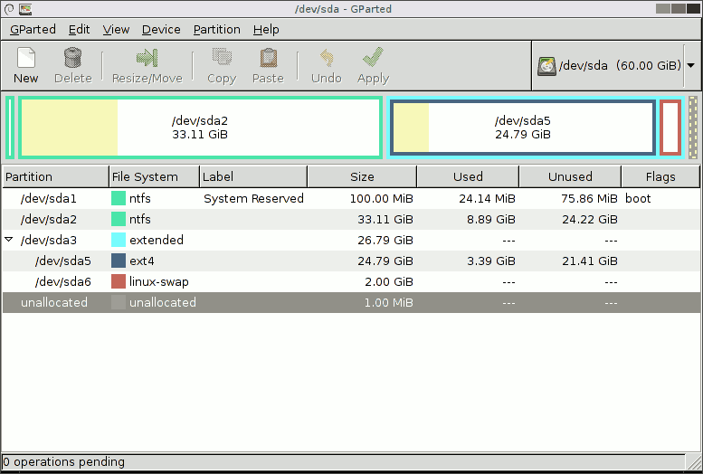
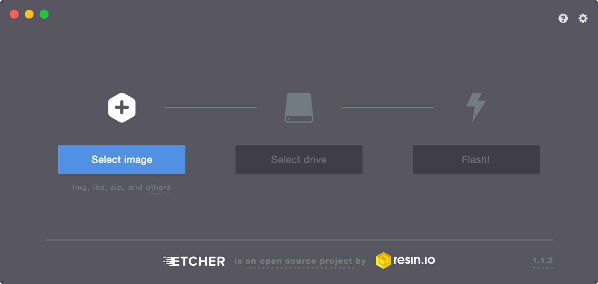

Wer mit Images arbeitet, kennt das Problem: Irgendwie müssen die Images auf die SD-Karte für den Raspberry Pi oder den USB Stick, um den PC aufzusetzen.
Dafür bietet sich Etcher an.
<!--more-->

Bisher habe ich das immer mit GParted (Partition Tool, zum Löschen und sicherstellen von nicht gemounteten bisherigen Partitionen auf dem Datenträger) und dem Command Line Tool `dd` gemacht.
Früher habe ich auch noch UNetBootin verwendet.

# GParted

GParted ist ein Partition Tool unter Linux und funktioniert, wie Partition Tools nun mal funktionieren.

GParted Screenshot von der offiziellen [Homepage](https://gparted.org)

Jedoch hat GParted (wie alle Programme die als Super User laufen müssen) ein Problem damit, unter Wayland richtig zu laufen.
Das kann man zwar für die aktuelle Session umgehen (`xhost +local:`), ist aber nicht wirklich schön.

# `dd`

`dd` ist, wie bereits erwähnt, ein Command Line Tool.
Ich habe mir einen `dd` Command zusammen gestellt und benutze immer genau diesen (`sudo dd bs=512k status=progress if=path-of-image-file.img of=/dev/sdb`).
Das funktioniert dann, ohne das ich mir großartig weitere Gedanken machen muss.
Ein Problem ist jedoch, das ältere Versionen von `dd` den Parameter `status=progress` nicht kennen und man so keine Informationen über den Fortschritt des ganzen erhält.
Außerdem muss bei älteren Versionen von `dd` mit einem folgenden `sudo sync` sichergestellt werden, das alle Daten wirklich auf den Datenträger geschrieben wurden und nicht noch im Write Cache stecken, bevor man den Datenträger entfernt.

# UNetBootin

Als Alternative dazu gibt es noch UNetBootin.

Screenshot von UNetBootin von der offiziellen [Homepage](https://unetbootin.github.io/)

Das Tool ist jedoch "nur" dafür gedacht, bootfähige ISOs auf USB-Sticks zu schreiben.
Das funktioniert unter Windows gut, unter Ubuntu hat dies damals auch funktioniert.
Mit meinem aktuellen Arch Linux ist es mehr ein Krampf die Oberfläche zu Gesicht zu bekommen, weswegen ich dann dafür auch wieder auf `dd` umgestiegen bin (auch weil das Arch Linux Image nicht mit UNetBootin funktioniert).

# Etcher

Etcher hat sich dem Schreiben von Images auf Datenträger gewidmet.

Screenshot von Etcher vom offiziellen [GitHub Repo](https://github.com/resin-io/etcher) übernommen.

Dabei übernimmt Etcher vom Entpacken der Image Datei über die Auswahl des Zieldatenträgers und sicherstellen des unmountens der Partitionen bis zum Verifizieren des geschriebenen Image alles.

Etcher ist mit dem Electron Framework umgesetzt und damit Cross Plattform einsetzbar.
Ich finde es ein gutes Beispiel dafür, das ein High Level Framework wie Node.js mit Electron doch sehr Hardware nahe Dinge wie Partition Checks, Images schreiben usw. machen kann.

Etcher wird Open Source und auf [GitHub](https://github.com/resin-io/etcher) entwickelt.
Für mich hat Etcher `dd` und Konsorten ersetzt.
Allerdings gucke ich aktuell noch immer, was Etcher eigentlich treibt, da es bei mir immer noch mal zu kleinen Problem kam (IO Fehler der SD Karte, Etcher sagt jedoch nicht, das er gar nicht voran kommt).
Ich gehe jedoch davon aus, das derartige Probleme in Zukunft behoben werden (Issues existieren bereits).
