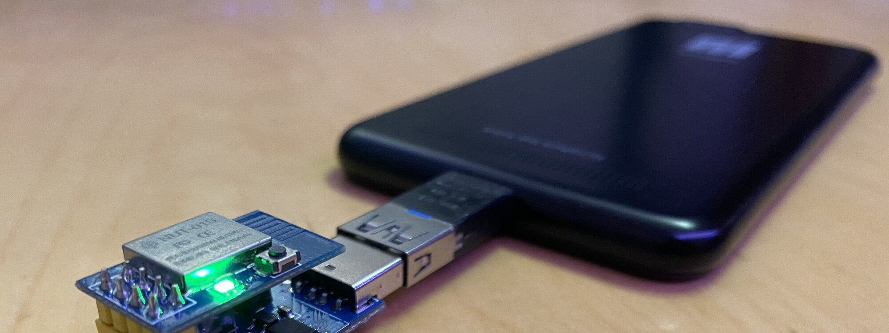

Ich würde gerne Rust auf Mikrocontrollern wie den ESP8266/ESP32 nutzen.
Espressif, die Firma hinter den ESPs arbeitet an einer LLVM Integration, wie sie auch für Rust benötigt wird.
Allerdings gibt es auch Chips, die bereits nativ von Rust unterstützt werden.
Und dabei kam ich an den PineCones, PineNuts und PineSeeds von Pine64 vorbei: RISC-V basierte MCUs im Format von ESP-01 und ESP-12.
Nach einer kurzen Suche habe ich festgestellt, dass es dort auch bereits Rust Experimente gibt und habe mir mal welche bestellt.
Und die sind nun hier.

Zuerst noch etwas zu der Benamung.
PineCone werden die Entwicklerboards genannt, auf dem sich ein PineNut befindet.
Aktuell gibt es hier nur [eines](https://pine64.com/product/pinecone-bl602-evaluation-board/), welches ein PineNut Model 12S ohne Shielding beherbergt.
PineNuts sind die Module im [ESP-12](https://pine64.com/product/pinenut-model12s-wifi-ble5-stamp/) oder [ESP-01](https://pine64.com/product/pinenut-model01s-wifi-ble5-module/) Formfaktor.
Auf den PineNuts befindet sich jeweils immer ein [PineSeed BL602](https://pine64.com/product/pineseed-bl602-wifi-ble5-soc/), welches ein [BL602 Chip von Bouffalo Lab](https://www.bouffalolab.com/bl602) entsprechend der [SiFive E24 cores](https://www.sifive.com/cores/e24) ist.
Der Core der PineSeeds ist zwar RISC-V und damit komplett Open Source, allerdings scheint der Wi-Fi / Bluetooth Device Treiber ein Closed Source BLOB zu sein.
Daher hat Pine64 die [NutCracker Challenge](https://wiki.pine64.org/wiki/Nutcracker) ausgerufen, hier Reverse Engineering zu betreiben um komplett mit Open Source arbeiten zu können.
Und um noch einen spannenden Link hinterher zu werfen: Es gibt auch eine relevante [Awesome List auf GitHub](https://github.com/mkroman/awesome-bouffalo).

# Erste Versuche Rust auf dem BL602

Zuerst habe ich versucht, dem ["Debug Rust on PineCone […]"](https://lupyuen.github.io/articles/debug) Artikel zu folgen und so das PineCone zu benutzen.
Ich habe allerdings nicht das Entwicklerboard verwenden wollen, sollte ja auch mit dem PineNut Model:01S und entsprechendem USB Programmer funktionieren.
Und ich kam nicht sehr weit.

Die erste Feststellung war, dass das verwendete OpenOCD (im Artikel verlinkt) nicht dem OpenOCD entspricht, welches in den Arch Repos verfügbar ist.
Das aus den Arch Repos bricht beim Starten sofort mit einer Fehlermeldung ab.
Wenn man die im Artikel verlinkte Version benutzt, funktioniert dies schon mal.

Allerdings brauche ich OpenOCD gar nicht, da dies zum Debuggen ist, ich will weder Debuggen noch habe ich einen JTAG Debugger hier.
Im Endeffekt muss ich doch also nur den Quellcode aus dem Repo des Artikels per Seriell / UART aufspielen?

Hier kommt das Tool [blflash](https://github.com/spacemeowx2/blflash) zu Hilfe.
Also Binary bauen und flashen.
Zum Flashen wird GPIO 8 auf High gezogen und resettet.
Hierfür gibt es auf dem USB Programmer einen Schalter und auf dem Entwicklungsboard einen Jumper.
Danach kann Flash Vorgang gestartet werden.
Wenn dieser fertig ist, kann der GPIO wieder auf Low gesetzt und das Board resettet werden.

Flashen und validieren funktioniert, laut dem Tool, allerdings passiert hinter nichts.
Welches von den Beispielen auch immer ich flashe, nichts davon scheint zu tun, was es soll.
Und so landete das Projekt erstmal wieder in der Schublade.

# Der QuickStart Guide

Einen Tag später probierte ich mich mal am [BL602 QuickStart Guide von Pine64](https://pine64.github.io/bl602-docs/Quickstart_Guide/Linux/Quickstart_Linux_ubuntu.html).
Statt gtkterm habe ich screen verwendet (`screen /dev/ttyUSB0 2000000`).
Ansonsten lief das auf Anhieb und ist cool anzusehen.
Nachdem man dies aufgespielt hat, bekommt man quasi eine Shell in der man Kommandos eingibt, die dann ausgeführt werden.
So kann man die GPIO über die serielle Shell steuern.
Ich habe auch das Beispiel für PWM ausprobiert, auch dort kann man über eine serielle Shell die onboard RGB LED auf unterschiedliche Farben und Helligkeiten einstellen.

# Chats lesen

Im NutCracker Chat gibt es eine Diskussion über die nicht vom flashen funktionierenden Rust Programme.
Andere haben das Problem also auch und auch schon nicht gelöst bekommen.
Ich dachte, damit wäre es erst mal für mich "vorbei", hab mir einen JTAG Debugger bei Ali bestellt (warum haben Amazon / Reichelt sowas nicht, ohne seine Seele dafür zu einzutauschen?) und angefangen diesen Blog Artikel zu schreiben.
Um im Artikel die passenden Links zu hinterlegen habe ich diese herausgesucht und dabei noch einen Hinweis im NutCracker Chat gefunden und ausprobiert.
Wenn man die `memory.x` anpasst und damit definiert, dass das Program in den Flash und nicht wie für das Debuggen benötigt in den RAM geschrieben wird, wird dies vom Chip gelesen und gestartet.
Ergebnis: Beim blink Programm blinkt die LED! (nachdem man auf den passenden GPIO gewechselt hat, an dem die LED anliegt)

Ich kann nun also grundlegende Rust Programme auf dem BL602 ausführen.
Yay!

# Nächste Schritte

Tendenziell wäre es cool, die onboard LED mit PWM ansteuern zu können.
Die Rust HAL verfügt noch nicht über die jeweiligen Methoden, aber es gibt Beispiele in C.
Vielleicht komme ich damit ja weiter.

Außerdem gibt es ein Beispiel zur seriellen Kommunikation, welches bei mir scheinbar nicht ganz richtig funktioniert.
Irgendwie kommt da Murks an.
Vielleicht finde ich ja auch dort noch mehr heraus.

Und was vielleicht auch noch spannend wäre: Es gibt einen [bl602 Rust Chat auf Matrix](https://matrix.to/#/#bl602-rust:matrix.org).
Da auf meiner viel zu langen ToDo Liste auch das "Matrix anschauen" steht, ist das vielleicht eine gute Gelegenheit.

To be continued…
