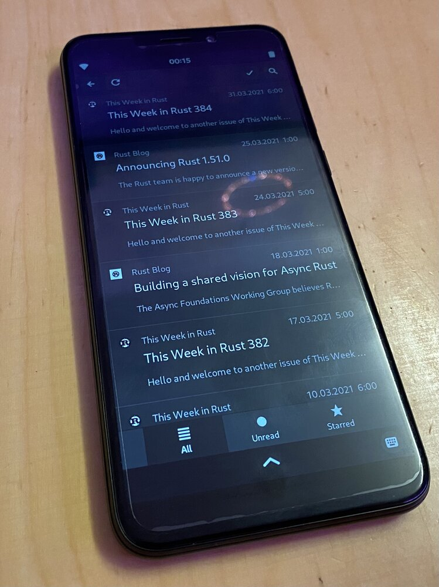

Ich benutze mein Handy zu viel für Belanglosigkeiten.
Ich hänge zu viel auf Social Media herum.
Immer up to date sein.

Gleichzeitig habe ich seit einem Vierteljahr ein PinePhone, welches ich leider nicht allzu viel nutze.
Da geht doch was.
<!--more-->

Wem das [PinePhone](https://www.pine64.org/pinephone/) nichts sagt, das ist quasi ein Raspberry Pi im Smartphone Format von Pine64.
In [einem älteren Artikel]() habe ich das PinePhone auch schon angeteasert, dort liegt es im Bild auf dem Tisch und versorgt einen PineNut der selben Firma(?) mit Strom.
An sich ein cooles Gerät, man kann eines von vielen Linux Betriebssystemen nehmen und entweder auf das eMMC aufspielen oder von der SD-Karte starten.
Funktioniert mehr oder weniger gut, man merkt, dass die Zielgruppe Entwickler sind, die dort verbessern und entwickeln wollen.
Nun habe ich das PinePhone schon seit einer Weile und experimentiere immer mal ein wenig damit, mal Manjaro mit KDE Mobile, mal mit Phosh, mal Lomiri (ehemals Ubuntu Touch, welches ich damals witzigerweise auch schon unterstützt habe, aber aus dem [Ubuntu Edge](https://www.indiegogo.com/projects/ubuntu-edge/) wurde ja nie etwas…)

Wie sorgt man dafür, weniger Belanglosigkeiten zu machen?
Entweder man erschwert diese, findet bessere Alternativen oder macht sie weniger belanglos.
Erschweren? Wie wäre es mit einem langsameren Gerät als dem für das meiste überdimensionierten Handy?
Weniger belanglos? Vielleicht lerne ich währenddessen etwas mehr über das PinePhone.

Also los, wie kann ich mehr Dinge mit dem PinePhone machen?
Was mache ich aktuell viel mit dem Handy?
Messenger, News, Social Media.

# Messenger

Dort wäre ich hauptsächlich bei Telegram, ein Nebenschauplatz wären XMPP und Matrix.

[Telegram Desktop](https://github.com/telegramdesktop/tdesktop) ist… sagen wir nicht gewillt, mobile Gerätedisplays unterstützen zu wollen.
Das Interface steht rechts über, damit ist so etwas wie der Senden Button nicht benutzbar.
Es gibt [mehrere Issues in unterschiedlichen Formen dazu im Telegram Desktop Repo](https://github.com/telegramdesktop/tdesktop/issues?q=pinephone), alle werden abgeschmettert.
Einen anderen Telegram Client habe ich bisher noch nicht probiert.
Der [Chat Client von Purism](https://source.puri.sm/Librem5/chatty) kann, zumindest laut Settings, Telegram, das wäre mal ein Experiment wert.

Nebenher experimentiere ich ein wenig mit XMPP und Matrix, in der Hoffnung einen besseren Messenger zu finden.
XMPP ist einfach, da benutze ich am Desktop eh schon [Dino](https://github.com/dino/dino), das läuft auch am PinePhone.
Fast, leider bisher nur als Desktop UI [ohne Anpassung für mobiles Layout](https://github.com/dino/dino/issues/178).
Aber da ist etwas in Arbeit.

[Matrix](https://matrix.org/).
Dort bin ich aktuell auf einem Server von einem Freund, welcher den Login mittelns Single Sign On und [Keycloak](https://www.keycloak.org/) abwickelt.
Beispielsweise der Client [Fractal](https://wiki.gnome.org/Apps/Fractal) sieht vielversprechend aus.
Single Sign On ist in Matrix spezifiziert, einige Clients können das, bei den meisten steht es jedoch auf der Todo Liste.
Ich kann mich aktuell also nicht einmal einloggen.

Schade eigentlich.
Vielleicht in ein paar Monaten.

# News

Für News nutze ich aktuell RSS Feeds.
Zumeist unter iOS am Handy oder Tablet.
Mein Blog hat übrigens auch einen [RSS Feed](/index.xml).

Irgendwie bin ich auf [NewsFlash](https://gitlab.com/news-flash/news_flash_gtk) gestoßen, ich weiß nicht mehr wie.
Vielleicht weil es eine Rust Anwendung ist, die GTK nutzt und ich soetwas auch immer mal ausprobieren will.
Wie auch immer, es läuft auf dem PinePhone und kann RSS Feeds.
Also die RSS Feeds von meinem bisherigen Reader exportiert und in NewsFlash importieren wollen, geht nicht.
Das Import Fenster geht nicht auf.
Ok, vielleicht liegt das daran, das eine GTK Anwendung auf dem zu dem Zeitpunkt benutzen KDE Mobile nicht allzu gut läuft?
Also Manjaro mit Phosh (Gnome-ish) auf eine SD-Karte und damit ausprobiert.
Import Fenster geht auf, läuft.

Nun lese ich seit Wochen meine RSS Feeds auf dem PinePhone.
Man merkt, dass das etwas langsamer lädt und das Interface nicht so flüssig ist, wie auf meinem normalen Handy, aber das hat mich auch nicht wirklich verwundert.
Außerdem war das Ziel doch entschleunigen :P

Tatsächlich funktioniert NewsFlash sogar zuverlässiger, was das Erkennen von Feeds gelesen / ungelesen angeht, als mein RSS Reader vorher.
Die mobile Anpassung für das UI funktioniert gut.
Ein wenig Wartezeit nach einem Klick muss man in Kauf nehmen, aber um Text zu lesen, braucht man definitiv keine großartige Geschwindigkeit.

Also schon mal ein definitiver Win.
Den RSS Reader am normalen Handy benutze ich tatsächlich nur noch als "OPML Quelle", welcher mein "Original" an RSS Quellen beinhaltet.
Ansonsten wird dieser nicht mehr genutzt.
Ein hoch auf freie Software mit freien Formaten, die man leicht in andere Tools bekommt.

# Social Media
Was Social Media angeht, werden mich sicherlich viele für komisch halten.
Ich benutze tatsächlich nur Mastodon.
Dinge wie Twitter, YouTube und Co verwende ich komplett ohne Accounts.
([Yotter](https://github.com/ytorg/Yotter) ist ein anonymes Frontend für Twitter und YouTube, welches ich für anonyme YouTube Subscriptions nutze.)

Einzig eine Möglichkeit, Bilder / Fotos zu teilen, vermisse ich aktuell.
Aktuell landen ein paar Bilder hier als Hintergründe im Blog, das war's.
Da wär vielleicht ein wenig mehr cool, vor allem weil ich regelmäßig mal nach "oh, das ist cool, schick mal" gefragt werde.
Es scheint also auch noch Leute zu interessieren.
Hier überlege ich, [Pixelfed](https://pixelfed.org) zu nutzen, habe ich aber bisher noch nicht weiter verfolgt.
Aber das ist auch definitiv kein PinePhone Topic, die Kamera macht eher "interessante" als gute Bilder.
Ist aber auch eine Kamera, die in ein $150 Gerät verbaut wird, wundert mich also nicht, dass diese nicht mit meinem Flaggschiff Handy mithalten kann.

Also gut, Mastodon Client.
Das Mastodon Maskottchen ist ein Mammut, eine Kurznachricht wird Toot genannt.
Als GTK Client gibt es [Tootle](https://github.com/bleakgrey/tootle).
Installiert, eingeloggt, läuft.
Falls du mir folgen möchtest, [auf chaos.social bin ich @EdJoPaTo](https://chaos.social/@EdJoPaTo).

Eine kleine Überraschung gab es noch:
Ein Toot mit Bild, das will ich mir größer ansehen, tippe darauf.
GIMP startet.
Mit einer besser gewählten Standardanwendung funktioniert auch das besser. ;)

# Fazit

Von PinePhone bin ich immer noch fasziniert.
Einfach solche Dinge, per ssh auf das Handy zu gehen, `reboot` benutzen und das Handy startet neu, sind irgendwie witzig.

Mit den Messengern bin ich leider nicht weit gekommen.
Aber da ist auch das Gerät, was immer dabei ist, das am meisten benutzte.
Das bleibt wohl noch eine Weile mein iPhone.

Wenn ich aber zu Hause bin (Oh wunder aktuell :P ) und "mal kurz RSS lesen" will, dann greife ich mittlerweile zum PinePhone.
Das dauert einen Moment länger, ich erfreue mich über einen Crash der Oberfläche oder sonstige, wundersame Seiteneffekte und lese meine RSS Feeds.
Es funktioniert definitiv nicht perfekt, aber es funktioniert alltagstauglich genug.
Und es erfüllt meine Ziele:
Ich kann mich erschwert mit meinen Belanglosigkeiten beschäftigen und nutze gleichzeitig das PinePhone häufiger.

Und wer sonst kann belustigt davon berichten, dass beim Betrachten eines Bildes auf Mastodon am Handy interessanterweise GIMP startet?
