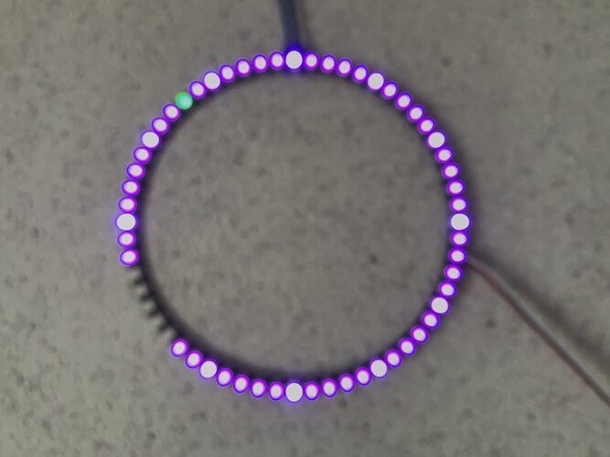

Ich habe bei mir mittlerweile seit über einem Jahr einen LED-Pixelring als Uhr hängen.
Am Anfang habe ich mir überlegt, wie ich diesen so nutzen kann, dass man auf einen Blick die Uhrzeit ablesen kann?
Normale Uhren verwenden dafür zwei (oder drei) Zeiger.
Sowas hat ein RGB LED Pixelring aber nicht.
Nach ein bisschen basteln bin ich auf eine Idee gekommen, die mittlerweile in einigen meiner Projekte wiederzufinden ist.

<!--more-->

Der Pixelring selbst besteht aus 60 RGB-LEDs, genau genommen WS2812 oder auch Neopixel LEDs genannt.
Das heißt, jede LED kann einzeln angesteuert werden.

In meinem allerersten Ansatz habe ich nur die 3 Grundfarben aus RGB verwendet.
Eine ist die Stunde, eine die Minute, eine die Sekunde.
Funktioniert, man kann die Zeit ablesen, aber irgendwie leuchten nur 3 LEDs von 60, nicht sonderlich spektakulär.
Und noch ein witziger Nachteil: im dunklen Raum fehlt einem der Zusammenhang.
Ist es beispielsweise 1:02:03, dann sind alle 3 Punkte oben rechts.
Im Dunklen sieht man aber nur die Punkte auf einem Haufen und weiß nicht, in welchem Zusammenhang die Punkte stehen.
Schon blöd, eine beleuchtete Uhr, die man im Dunklen nicht lesen kann.

In einem weiteren Versuch habe ich nur Stunde und Minute angezeigt und diese quasi verbunden.
Der Kreisabschnitt nach der Stunde bis zur Minute war beispielsweise blau und der Kreisabschnitt nach der Minute bis zur Stunde war rot.
Dies hat als Vorteil, dass man relativ schnell den Kontrast erkennt, wo genau die Punkte sind.

Ich weiß nicht mehr, wie genau ich darauf kam, aber eine entscheidende Grundlage dazu ist die [Farbdarstellung HSV](https://de.wikipedia.org/wiki/HSV-Farbraum).
Dabei werden die Farben in Hue, Saturation und Value (=Brightness) oder zu Deutsch Farbton, Sättigung und Helligkeit angegeben.
Der Farbton wird dabei häufig als Kreis dargestellt, da sowohl 0° als auch 360° rot sind.
Sättigung und Helligkeit werden meist in Prozent angegeben.
Hat die Farbe keine Sättigung, so ist sie weiß.
Hat die Farbe keine Helligkeit, so ist sie schwarz.
Damit lassen sich alle Farben beschreiben.
Zum Beispiel grün ist bei 120°, hellgrün hat eine geringere Sättigung und dunkelgrün eine geringere Helligkeit.
Ich arbeite relativ gerne mit HSV statt mit RGB, da man mit der Anpassung von nur einem der drei Werte schon schöne Verläufe erzeugen kann.

Quelle: <https://commons.wikimedia.org/wiki/File:HueScale.svg>

Das entscheidende Detail, welches mir auffiel: 6 Stunden sind 360 Minuten und die Farbtonskala hat 360°.
Ein Tag kann in vier 6 Stunden Blöcke aufgeteilt werden.
Eine normale Uhr macht das ähnlich, nur wird hier in zwei 12 Stunden Blöcke geteilt.

Dies zu berechnen ist dank Modulo einfach:

```js
minuteOfDay = (hour * 60) + minute;
hue = minuteOfDay % 360;
```

Mit dieser Idee haben 0 Uhr, 6 Uhr, 12 Uhr und 18 Uhr jeweils die gleiche Farbe: 0° ist rot.
Sehe ich also rot, muss es eine dieser 4 Uhrzeiten sein.
Schaue ich zusätzlich aus dem Fenster, ist es dunkel oder hell bzw. bin ich gerade aufgestanden oder sollte ich zu Bett, weiß ich damit die grobe Zeit.

Wichtig für eine gut lesbare LED Installation immer der Kontrast.
Diesen kann man gut erkennen.
Stelle ich also den gesamten Kreis im Farbton der Zeit dar, kann ich die LED der Minute aus lassen.
Die Lücke ist dann relativ klein und wurde relativ schnell auf 3 LEDs ausgeweitet.
Mittlerweile ist sie bei 5 LEDs, was die Uhr noch schneller lesbar macht.
Fast wie beim Augenarzt, auf welcher Seite ist der Kreis geöffnet?

Problem: Wo ist eigentlich oben? Oder rechts?
Gerade im Dunkeln kann man den Kopf schief legen und man hat eine andere Zeit.
Es könnte 11:58 oder 12:02 sein, ohne Stundenmarkierungen fehlt die Genauigkeit.
Das Schöne an HSV, man kann jeden Wert einzeln manipulieren.
Ich habe also für die Stundenmarkierungen nur die Sättigung reduziert, alles andere bleibt gleich.

Für die Sekunden habe ich die Komplementärfarbe gewählt.
Auch relativ einfach zu berechnen, diese ist 180° weiter.


Das Foto ist mit falschem Fokus gemacht worden, um die LEDs besser sehen zu können.
LEDs haben die Angewohnheit, sehr punktuell deutlich heller als ihre Umgebung zu sein und das können Kameras nicht sonderlich gut fotografieren.

Um die Uhr zu lesen, schaut man sich die Details an.
Die Farbe ist ein dunkles Lila. Es ist also irgendwo um 5 Uhr, da dunkel, sprich Richtung Blau, muss es vor 5 Uhr sein.
Die Lücke ist genau mittig zwischen der 35 und 45 Minuten Markierungen, es ist also genau :40.
Der Sekundenzeiger ist bei 53 Sekunden.
Es ist also 4:40:53, 10:40:53, 16:40:53 oder 22:40:53, je nach Tageszeit.

Der Quellcode der Uhr ist auf [GitHub](https://github.com/EdJoPaTo/esp-mqtt-neopixel-clock) zu finden.

Mittlerweile verwende ich den Farbton abhängig der Tageszeit an mehreren Orten.
Meine Akzentbeleuchtung ist beispielsweise häufig in der Farbe.
So ist sie nicht immer gleich, aber irgendwo auch interessant.
Die LED Matrix, welche im Fenster zur Straße heraus ist und die aktuelle Außentemperatur anzeigt, ist ebenfalls in dieser Farbe.
Ich bezweifle aber, dass irgendjemand vorbeigehendes die Logik hinter der Farbe bisher verstanden hat.
Ein weiterer Ort ist diese Webseite.
Die Hintergrundfarbe und die Farbe der Links sind ebenfalls abhängig von der Tageszeit.
Um 8 Uhr morgens grün, um 9 türkis, um 10 blau und um 14 Uhr wieder grün.

Funfact am Rande: Um 4 kann man blau machen.
