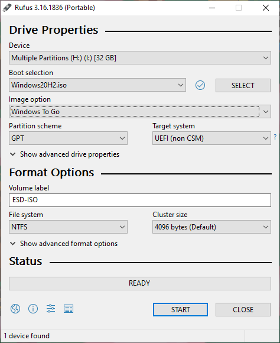

Seit meine Grafikkarte bei Spielen nur noch lauter rote Punkte produziert und dann abschmiert, habe ich keinen Computer mehr zum Zocken.
Der Arbeitslaptop hat eine Grafikkarte, allerdings ist das mit privater Software auf Firmengeräten so eine Sache.
Aber da wird man doch wohl etwas hinbekommen um nur die Hardware, aber nicht die Software zu nutzen.

<!--more-->

# Wie wird's installiert?

[Rufus](https://rufus.ie) ist ein Tool zum Beschreiben von USB Geräten mit ISO Dateien (Windows only).
Normalerweise [benutze ich Ventoy]() für diesen Zweck, viel bequemer.
Allerdings hat Rufus ein Feature, welches ich hier benötige: "Windows To Go".

Man startet Rufus, wählt die externe SSD (später dazu mehr) und die Windows ISO Datei aus.
Die ISO bekommt man [hier von Microsoft](https://www.microsoft.com/en-us/software-download/windows10ISO) (man möchte 64-Bit).
Rufus erkennt dann automatisch das Windows in der ISO und bietet "Image Options" an.
Hier wählt man "Windows To Go".
Das war's soweit schon, man kann den Schreibprozess starten.

Die SSD wird dann an den Firmenlaptop angeschlossen und mit der jeweiligen Taste beim Starten die Boot-Optionen aufgerufen.
In meinem Fall bei Dell mit F12.
Dort wählt man dann das USB Gerät aus (wenn dies mehrfach existiert, muss als UEFI gestartet werden).
Leserkommentar: Möglicherweise muss man Secure Boot deaktivieren oder BIOS Einstellungen anpassen, damit von USB gebootet werden kann.

Die Windows Installation begrüßt einen mit Dark Pattern gespickten Fragen.
Hier wählt man so lange die Buttons mit dem schlechtesten Kontrast auf dem Bildschirm ("nein", "nur offline", "kein Tracking", …), bis man auf dem Windows Desktop angekommen ist.
Windows Updates laufen lassen, natürlich regelmäßig neu starten und danach waren alle Grafiktreiber usw. installiert, die ich brauche.
Da die Windows Lizenz vom Gerät kommt, muss auch kein Lizenzschlüssel irgendwo eingetragen werden, dies ist also auch kein Problem.
Noch Steam und Co installieren, Spiele herunterladen und los gehts.

# Was für eine externe SSD brauche ich?

Initial war die Überlegung, ob sich eine externe M.2 NVMe SSD lohnt, da diese zwar schneller aber auch deutlich teurer sind.
Ich habe mir dann zum Testen eine relativ günstige 256 GB USB 3.0 M.2 SATA SSD gekauft.
Das funktioniert soweit gut (Fun Fact gleich).
Auf einem Samsung 128 GB USB 3.2 USB-Stick habe ich [ALMA (Arch Linux Mobile Appliance)](https://github.com/r-darwish/alma) installiert.
Der Stick hat noch mal schlechtere Lese / Schreibwerte im Vergleich zur SSD, aber trotzdem funktioniert das relativ gut.
Gerade weil eben schon alles, was man braucht, schon per ALMA installiert wird und der Stick so bereits fertig beschrieben wird.
Ein Windows würde ich auf dem USB-Stick allerdings nicht installieren, man hat schon seine Ladezeiten gemerkt und das wird bei Windows nur schlimmer sein.

Fun Fact: nach einigen Wochen immer mal Destiny 2, Diablo 3 oder Bloons TD spielen ist mir aufgefallen, ich habe die SSD immer von USB 2.0 gebootet.
Davon habe ich allerdings nichts gemerkt.
Destiny 2 hat eh utopisch lange Ladezeiten, bei denen man auf Server wartet und Diablo 3 oder Bloons TD waren jetzt nicht übermäßig langsam.
Definitiv nicht so schnell wie eine integrierte SSD, das habe ich aber in meinem Kopf auf die externe SSD und nicht auf USB 2.0 geschoben.

Ich würde also sagen, da diese Lösung eh für das Casual Gaming gemacht ist, wird man nicht merken, wenn man statt einer "normalen" SSD eine NVMe Platte verwendet.
Wenn man mehr als Casual Gaming will, wird man sich wohl auch einen richtigen Rechner mit verbauter NVMe SSD zulegen.

Als Größe der SSD habe ich eine 256 GB SSD, die reicht mir vollkommen aus.
Aktuell habe ich 2 riesige Spiele (zum Beispiel eben erwähntes Destiny 2) und ein paar ältere Spiele installiert.
Damit sind 180 GB von 239 GB belegt, also noch 59 GB frei.
Wie eben schon erwähnt ist das ganze eine Lösung für Casual Gamer, ich muss also nicht meine gesamte Spielesammlung installieren können, ein paar Spiele reichen schon.

Und zum Vergleich: mein ALMA Stick hat 25 GB von 128 GB belegt und dabei [mein gesamtes Linux](https://github.com/EdJoPaTo/LinuxScripts) installiert.
Dort sind aber auch keine Spiele (abgesehen von Sudoku) installiert.

# Fazit

Mit meinem Firmenlaptop und einer externen Festplatte, von der ich boote, kann ich nun fröhlich immer mal irgendwas spielen.
Mein PC mit kaputter Grafikkarte war schon seit Monaten nicht mehr an.
Da dieser Weg doch recht gut funktioniert, ohne dass ich Hardware kaufen müsste, bin ich damit doch recht zufrieden.
