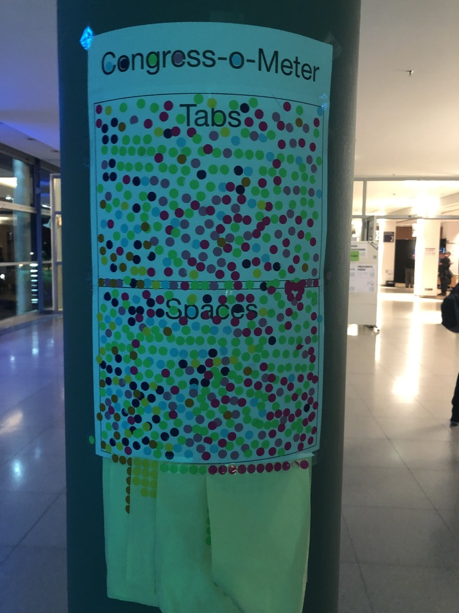

Wie wäre es mit einem Thema, das schon genug dazu beigetragen hat, dass sich Menschen in die Haare kriegen?
Einrückung mit Tabs oder Leerzeichen?
Wenn ich jetzt noch sage, meistens ist mir das egal, stifte ich vermutlich noch mehr Verwirrung.

Beispielsweise bei Rust benutze ich `cargo fmt` und was auch immer da dann zur Einrückung benutzt wird, ist mir recht.
Bei TypeScript/JavaScript sieht das schon wieder anders aus, allerdings nicht bei dem Quellcode den ich selbst schreibe.
<!--more-->



# Quellcode Libraries

Ich habe ein paar Node.JS packages auf NPM.
Diese sind alle in TypeScript geschrieben und werden als JavaScript + Typen ausgeliefert.
Die Transpilierung wird dabei von `tsc` (TypeScript Compiler) übernommen.
Und hier kommt dann das Problem für mich: Das Ergebnis verwendet Leerzeichen.

Das Ergebnis wird auf NPM hochgeladen, bei allen Nutzern heruntergeladen und liegt dort dann herum.
Im Fall von meiner [grammy-inline-menu](https://github.com/EdJoPaTo/grammy-inline-menu) Library sind das so einigen Leerzeichen.

Mit Leerzeichen (`npm pack`):
```plaintext
=== Tarball Details ===
name:          grammy-inline-menu
version:       7.0.2
filename:      grammy-inline-menu-7.0.2.tgz
package size:  52.8 kB
unpacked size: 273.2 kB
total files:   123
```

Mit Tabs:
```plaintext
=== Tarball Details ===
name:          grammy-inline-menu
version:       7.0.2
filename:      grammy-inline-menu-7.0.2.tgz
package size:  52.8 kB
unpacked size: 272.9 kB
total files:   123
```
Die packaged size ist nur minimal kleiner, ausgepackt sind dies aber schon ein paar hundert Bytes.
Das mag für dieses eine Paket nun relativ verschwindend sein, summiert sich aber auf.

Dass der `node_modules` Ordner ein bodenloses Loch für einige Projekte darstellt, ist ja für viele bekannt.
Ich habe in dem Projekt im `node_modules` Ordner jeweils 4 Leerzeichen gegen Tabs ausgetauscht und mittels `du` die Gesamtgröße des Ordners verglichen:

```zsh
du -d 0 node_modules
sed -i 's/    /\t/g' node_modules/**/*.js
du -d 0 node_modules
```

Das beinhaltet nur die JavaScript Dateien, nicht die TypeScript Typen (`.d.ts`) und jegliche weiteren Dateien sind hierbei ebenfalls nicht betrachtet.
181456 → 169488, sprich -11968 Bytes bzw. eine Verringerung um 6,6 %.

Alles Daten die übertragen, analysiert und herumliegen werden.
Tabs vs. Spaces die niemanden interessieren, weil dort eh niemand editieren wird.
Lesbar sind auch Tabs genauso und sparen eine Menge ein.


Das Ganze gilt nicht nur für Quellcode Libraries, sondern generell für jegliche automatisch generierten Dateien.
Wenn im Browser HTML angezeigt wird, interessiert mich nicht, ob da Tabs oder Spaces benutzt wurden.
Bei dargestellten SVG genauso.
(Meckern auf hohem Niveau, da man sicherlich so einige Pixelgrafiken erstmal überhaupt als SVG darstellen könnte.)

Hier sollten aus meiner Sicht mehr Tools Dateien generieren, die, wenn sie denn lesbar bleiben sollen, Tabs statt Spaces verwenden.

Ja ich bin mir bewusst, das Kompression dies teilweise ausgleicht, aber trotzdem helfen Tabs.
Aus meiner Sicht eine low-hanging fruit, mit der man an einigen Stellen Datenmengen einsparen kann.

# Source Maps

Hier werden dann auch Source Maps relevant.
Wenn man beispielsweise Quellcode hat und diesen möglichst kompakt ausliefern will, wirft man Leerzeichen, neue Zeilen, Variablennamen usw. raus, um möglichst kleine Dateien zu haben.
Dies wird vor allem im Web genutzt.
Will man diese Dateien dann sinnvoll lesen, ist das aber eher schwierig.

Source Maps helfen dabei, da sie die Information enthalten, wie die Datei ursprünglich aussah und wo jetzt was gelandet ist.
Man kann also mit der kompakten, unleserlichen Quellcode Datei und der Source Map die Originaldatei "simulieren".
Man kann sich diese nicht nur ansehen, sondern auch benutzen wie diese.
Breakpoints und Debugging ist beispielsweise möglich.

Wir sparen uns also für einen Großteil der Nutzer den großen Quellcode und liefern verkleinerte (minified) Dateien aus.
Wenn es jemanden interessiert, können auf Nachfrage (meistens des Browsers) auch Source Maps ausliefern.
So haben wir sowohl kleine Dateien als auch Lesbarkeit bei Bedarf.

Source Maps funktionieren dabei auch in andere Programmiersprachen.
So kann man beispielsweise SASS in CSS umwandeln und sich dann über die Source Map das SASS anschauen.
Ebenso bei JavaScript zu TypeScript.

Für beispielsweise HTML ist eine Source Map vermutlich irrelevant, da XML gut autoformatiert werden kann.
Schaut man sich beispielweise HTML mit den Browser Developer Tools an, ist dies gut formatiert.

# Fazit

Wen interessiert es, dass das cheese.svg auf der [Einstiegsseite ](/) nun Tabs oder Leerzeichen verwendet?
Es sieht genauso aus und weiterhin lesbar für Menschen, die in den SVG Quellcode schauen.
Und spart mit einfachen Mitteln Datenmengen, die zwar im Einzelnen vernachlässigbar sind, sich aber aufsummieren.
