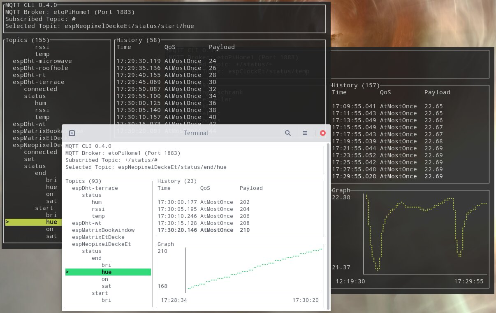

Ich benutze für meinen Haufen verteilter Mikrocontroller und Kleinstcomputer, der sich vielleicht Smart Home schimpfen könnte, MQTT.
Warum und wie das bei mir läuft, wäre vermutlich einen eigenen Blogpost wert.
Hier soll es jedoch um den Blick auf das, was im MQTT passiert, gehen.
Und dafür habe ich eine Terminal UI Anwendung gebaut.
<!--more-->

## Wie kam es dazu?

Um einen Überblick über die Topics und die Werte zu bekommen, gibt es Tools wie den [MQTT Explorer](https://mqtt-explorer.com/).
Hilfreiches Tool, allerdings basiert es auf Electron und gewinnt damit keinen Effizienzpreis.

Und mal eben etwas von der Kommandozeile publishen ging auch nicht so einfach wie ich gern hätte.
Es gibt zwar Projekte wie [hivemq/mqtt-cli](https://github.com/hivemq/mqtt-cli), aber dieses ist durchaus träge und die vielen CLI-Argumente machen das Tool zwar mächtig aber nicht gerade benutzerfreundlich und einfach.
Und wenn man mehrere Topics auf einmal subscribed, kommen trotzdem nur die Values ohne weitere Informationen durcheinander gewürfelt zurück, was einem dann nichts mehr bringt.

## Das eigene Tool

Relativ am Anfang von meinen Rust Experimenten kam ich an Terminal User Interfaces (TUI) vorbei und dachte mir, damit krieg ich das doch auch hin.
Und so existiert seit über einem Jahr `mqttui`, welches stetig an meine Anforderungen angepasst und verbessert wird.

Wenn man `mqttui` startet, öffnet sich das interaktive Terminal UI wie im Screenshot zu sehen.
Auf der linken Seite sind die Topics in einer Baumstruktur einsortiert.
Auf der rechten Seite sind Details zum aktuell gewählten Topic.
Dabei sind von oben nach unten der aktuelle Wert (mit JSON Formatierung), eine Tabellenansicht der zeitlich letzten Werte und bei Zahlenwerten ein Graph dazu zu sehen.

Entwickle ich nun zum Beispiel an einem Sensor, Aktor oder was auch immer, kann ich mir so nebenbei anschauen, was gerade an MQTT Nachrichten passiert.
Und man kann diese interaktive Ansicht in einem Terminal im Hintergrund offen lassen, ohne sich über den Ressourcenverbrauch zu wundern, wie man das bei Electron häufiger macht.

Wenn man mal eben etwas publishen will, greift man zum subcommand `mqttui publish topic value`.
Wenn man einige Topics zeitlich linear beobachten will, kann man diese mit `mqttui log` auf stdout loggen.

Das Tool existiert seit mittlerweile über einem Jahr und tut fröhlich was ich brauche.
Selten habe ich den MQTT Explorer noch mal offen, einzig das Feature um einen Baum an Topics aus den retained Nachrichten zu löschen, vermisse ich manchmal.
Könnte ich mal einbauen…

Das Tool gibt es vorkompiliert auf [GitHub](https://github.com/EdJoPaTo/mqttui/releases), im [AUR](https://aur.archlinux.org/packages?K=mqttui) und scheinbar auch auf [NixOS](https://search.nixos.org/packages?channel=unstable&query=mqttui).
