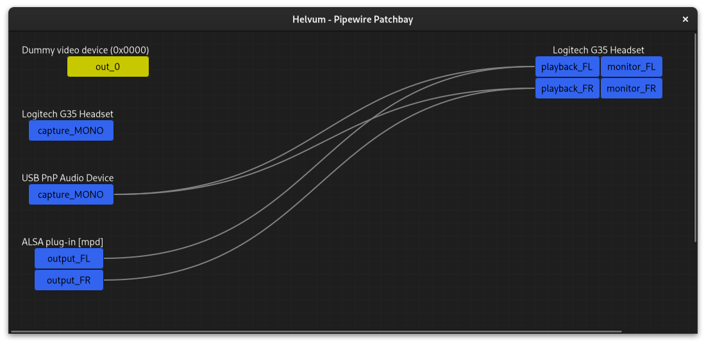

Neben meinem im Alltag genutzen Linux steht ein Windows-PC, der immer mal zum Zocken verwendet wird.
Die Kopfhörer stecken im Linux PC und ich will diese dort auch benutzen, zum Beispiel für die Audio-Kommunikation.
Trotzdem will ich das Audio von Windows hören.
Pipewire kann Audio Streams umleiten, da geht doch was.

<!--more-->

Mit einer USB Soundkarte habe ich einen dedizierten Mikrofon Eingang, in den ich ein Audiokabel vom Kopfhörerausgang des PCs stecken kann.
Besser wäre ein Line-in, aber so habe ich schon mal Mono, besser als nichts.
Im Windows wird in den Accessibility Einstellungen Mono aktiviert und die Lautstärke auf Maximum geregelt um die beste Qualität im Linux einstellen zu können.

Öffnet man jetzt `pavucontrol`, sieht man in den Input Devices das weitere Mikrofon und wenn im Windows Audio ausgegeben wird, auch Ausschlag.
Damit die ebenfalls integrierte Audioausgabe der USB-Soundkarte verschwindet, habe ich unter "Configuration" auf "Mono Input" umgestellt.
Hören tun man aber noch nichts.

Im Hintergrund verwende ich Pipewire und habe mal im Arch Wiki geschaut, was es da so gibt.
Fündig geworden bin ich mit Helvum, womit man Pipewire Geräte zusammen stecken kann.

Man kann per Drag & Drop Geräte miteinander verbinden und wieder trennen.
Im Screenshot sieht man das automatisch verbundene ALSA Plugin von `mpd` und das von mir manuell verbundene USB Audio Device auf mein Headset.
Ich höre also gerade gleichzeitig den Output von Windows als auch [Musik über `mpd`]().

Hat man zusätzlich noch mehr Dinge offen, alles was eben über Pipewire läuft, Mumble, unterschiedliche Browser Tabs mit Audio, `pavucontrol`, Screen Sharing usw. wird es in helvum aber auch schnell unübersichtlich, da jeder Pfad dargestellt wird.

Unter "Input Devices" in `pavucontrol` regele ich die Lautstärke von Windows herunter.
Damit hat das Windows immer die maximale Lautstärke und somit die bestmögliche Qualität (Signal to Noise Ratio, ist ja ein analoges Signal).

Mit diesem Setup kann ich auch mittels OBS auf Windows sämtlichen Sound einfach mit streamen, läuft ja nur das Spiel und es sind keine anderen Menschen aus irgendwelchen Gesprächen nebenbei zu hören.
Geht bestimmt besser, funktioniert für mich aber gut genug für das immer mal zocken.
Und noch habe ich den Stereo Sound im Vergleich zum aktuellen Mono nicht stark genug vermisst.
