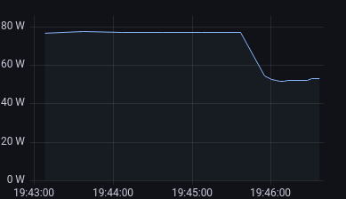

Ok, diese Kausalkette muss ich wohl erklären.
[Seit ich Gnome 42 benutze](), benutze ich die neue Console.
Diese kann automatisch dem Desktop Theme folgen, ist also ebenfalls hell oder dunkel.
Und das spart indirekt Strom, da ich nicht mehr so helle Monitorhelligkeiten brauche.
<!--more-->

Auch vorher schon habe ich meinem Theme tagsüber hell und nachts dunkel eingestellt.
Vor Gnome 42 war das der GTK Theme, in meinem Fall `adwaita` und `adwaita-dark`.
Mein Terminal vor Gnome 42, [`alacritty`](https://github.com/alacritty/alacritty), hat jedoch einen festen Theme und war immer dunkel.
Fand ich auch nicht schlecht, habe ich nicht groß darüber nachgedacht.

Um die neue Console zu testen, habe ich sie mit [meinem Gnome 42 Update]() als Standard eingestellt.
Eine spannende Feststellung: Durch das weiße Terminal stelle ich die Bildschirmhelligkeit nicht mehr so hoch und kann es trotzdem noch gut lesen.
Da ich über 10 Jahre alte Monitore (2x Dell U2711) verwende und die eine vergleichsweise hohe Leistungsaufnahme haben, kann man die Bildschirmhelligkeit in der Strommessung ablesen ([Shelly 2.5](https://shelly.cloud/products/shelly-25-smart-home-automation-relay/)).

In diesem Beispiel habe ich mal die Monitorhelligkeit von 25 % auf 5 % heruntergestellt, abends passend, bei Sonnenschein allerdings zu dunkel.
Das hat eine Änderung von 77.1 W zu 52.9 W gebracht, 25 W Unterschied bei einem Monitor.
Macht bei zwei Monitoren 50W, damit kann man 6 Mac Studio im Idle betreiben.
Wenn die Sonne hereinscheint habe ich häufig auf 60 % gestellt und jetzt hat, mit der hellen Console, auch 40 % gereicht.

Das ist bei neueren Monitoren nicht annähernd so signifikant, aber eine spannende Feststellung, über die ich vorher nicht nachgedacht hatte.
Eher ist ein Blick in die Power Settings relevant.
Zum Beispiel die Zeit bis der Monitor ausgehen darf.
Eine oder zwei Minuten reichen aus meiner Sicht völlig aus.
Videoplayer zum Beispiel halten den Bildschirm aktiv und Tools wie [Caffeine](https://github.com/eonpatapon/gnome-shell-extension-caffeine) unter Linux oder [KeepingYouAwake](https://keepingyouawake.app/) unter macOS helfen für ähnliche Zwecke.
Und wenn man eh nicht auf den Monitor schaut, können diese auch ausgehen.

Mit ein bisschen darüber nachdenken kann man relativ einfach Strom sparen.
Und es zeigt mal wieder, wie viel eine Visualisierung von etwas bringt, wenn man etwas ändern will.
