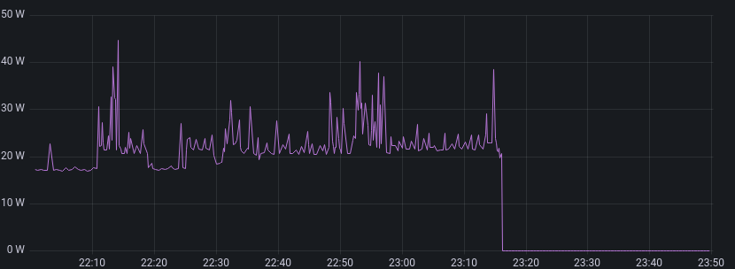
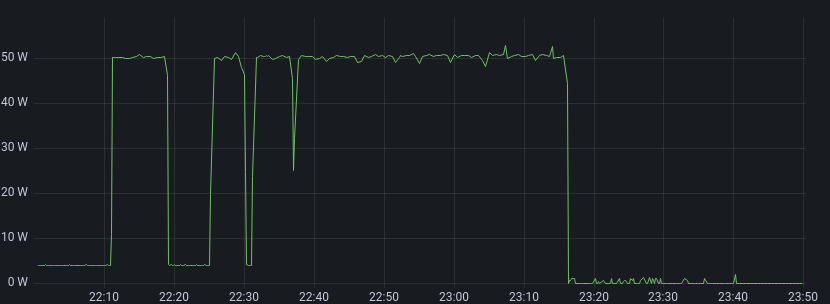
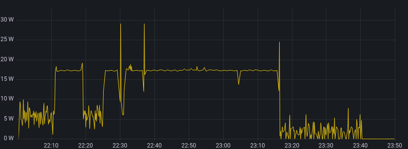
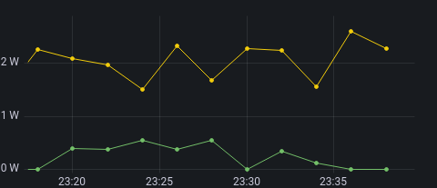

Ich bastele immer mal wieder an meinem halbwegs smarten Home herum und hatte nun den Plan, wie ich sinnvoll erkennen kann, wann meine Monitore nicht genutzt werden.
Die "Steckdosenleiste", in der Monitore und Computer stecken, beinhaltet 4 Shelly 2.5, welche sich über MQTT steuern lassen und den Stromfluss messen.
Ich weiß also immer, ob ein Gerät gerade eingeschaltet ist und ob und wie viel Strom es gerade verbraucht.
Damit sollte man doch automatisieren können, die Monitore abzuschalten, wenn sie nicht mehr benutzt werden.
Bisher habe ich nur die Computer automatisch abgeschaltet.

<!--more-->

Die Computer sind einfach: Selbst wenn der Bildschirm gelockt ist, verbrauchen sie noch deutlich mehr Strom verglichen mit ihrem Aus-Zustand.

Im folgenden Graphen sieht man den Stromverbrauch eines NUC7i7.
Es ist relativ klar, wann dieser an und wann dieser aus ist.
Wann das Relais geschaltet hat und der NUC stromlos wurde, sieht man nicht mal, das Netzteil scheint gut zu sein.
(Mein NUC5i3 sieht hier ähnlich aus.)

Die Monitore sind da komplizierter.
Natürlich weiß ich, wenn der NUC an ist, ist der Monitor auch relevant und sollte damit nicht aus gehen.
Das funktioniert nur mit dem Laptop nicht, da der Laptop über USB-C über den Monitor geladen wird.
NUC ist aus, also würde mit der Logik der Monitor trotz Laptop ausgehen.
Also würde ich gern komplett eigenständig anhand des Monitors erkennen, was passieren soll.

Bei den U2711 Monitoren ist es auch vergleichsweise einfach zu erkennen, in welchem Zustand sich dieser quasi befindet.
Man erkennt sowohl die "An" Zeiten, als auch die "Standby" Zeiten, weil der Computer gerade gesperrt ist.
Auch ist erkennbar, ab wann der Monitor quasi aus ist.
Gegen 23:40 habe ich das Relais manuell aus geschaltet, damit fehlt auch das letzte bisschen Stromverbrauch.

Bei meinem [neuen Dell U2722DE]() ist das nicht mehr ganz so einfach.
Man sieht, dass dieser bei Benutzung deutlich weniger Strom verbraucht (man achte auf die Skala).
Wenn der Computer gesperrt ist, verbraucht der U2722DE sogar etwas mehr Strom als der U2711 (~6W vs. 4W).

Hart finde ich jedoch, wenn der NUC aus ist und die beiden Monitore im Standby sind.
Für den folgenden Graphen habe ich einen Average von immer 4 Werten genommen um das starke Zittern vom U2722DE loszuwerden.
Verglichen mit den 0.3W Standby aus dem Datenblatt des U2722DE ist das hier deutlich mehr.
Spannenderweise stehen im Datenblatt vom U2711 2W für Standby.
Und nein, ich habe nicht die Monitore vertauscht, ich hab extra nochmal geschaut. ;)

Man muss dem Ganzen allerdings zugutehalten, das ich nicht unterschiedliche Messgeräte benutzt habe, sondern immer denselben Sensor für das jeweilige Gerät.
Die Shellys werden da nicht unbedingt die beste Hardware verbaut haben, aber grundsätzlich sollte das vergleichbar sein.

Ich schalte meine Monitore aus, von daher betrifft mich der höhere Standby-Strom nicht unbedingt.
Aber es ist definitiv spannend zu sehen, dass bei einem 10 Jahre neueren Monitor nicht alles besser ist.

Wann der U2711 benötigt wird, ist einfach zu erkennen.
Ist der Monitor für einen Zeitraum durchgehend unter 3W, wird er nicht benutzt.
Durch die stark variierenden Werte des U2722DE ist das hier nicht ganz so einfach.
Durchgehend unter 8W könnte zeitweise auch erkennen, wenn der Computer gesperrt ist.
Das macht es leider komplexer als ich haben wollte…
