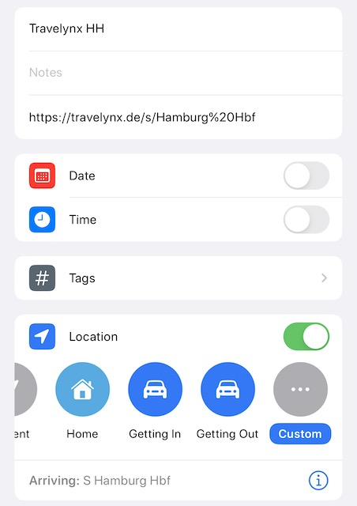

Ich benutze seit einiger Zeit Travelynx, um meine Zugnutzung zu tracken und um im Fernverkehr auch schneller meiner Fahrgastrechte gebrauch zu machen.
Problem an meiner Alltagsstrecke: Ich vergesse häufig, den genutzten Zug auszuwählen.

[Travelynx](travelynx.de) ist eine quelloffene Webseite, die auf meinem Smartphone weder positionsbasiert noch im Hintergrund agieren kann.
Trotzdem möchte ich daran erinnert werden, meine Zugverbindung einzutragen.
Dafür habe ich mir in meinem Smartphone (iOS) ortsbasierte Erinnerungen eingerichtet.
Wenn ich in der Nähe von einem Bahnhof ankomme, für den ich eine Erinnerung eingerichtet habe, bekomme ich jetzt automatisch eine Erinnerung an Travelynx.
Einen weiteren Zwischenschritt spare ich mir hier, da ich die URL vom Bahnhof direkt in der Erinnerung hinterlege.
So habe ich in der Erinnerung für beispielsweise Hamburg Hbf die dazu passende URL hinterlegt (<https://travelynx.de/s/Hamburg%20Hbf>) und kann ohne weitere Navigation auf der Seite direkt meinen Zug auswählen.
Wichtig ist noch daran zu denken, die aufkommende Erinnerung nicht als abgeschlossen zu markieren, sonst kommt sie beim nächsten Mal nicht wieder auf.

Das habe ich für die häufigen Bahnhöfe gemacht, bei ICE Fahrten denke ich normalerweise selbst dran.
Läuft bisher seit einigen Wochen so und das ziemlich erfolgreich, ich vergesse kaum mehr Zugfahrten einzutragen.
Aus meiner Sicht eine relativ einfache Lösung mit Boardmitteln von iOS, die ohne viel Komplexität mein Problem löst.
