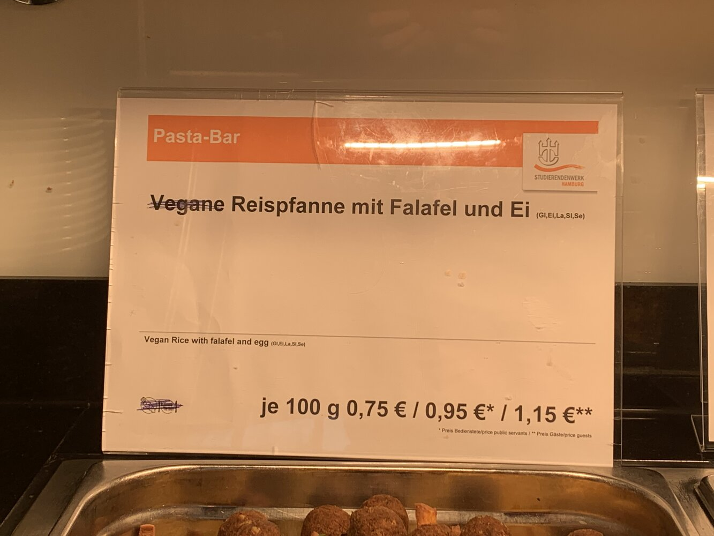

Ich sitze (dank meines Kalenderbots für die Veranstaltungspläne der Hochschule) auf den Daten der Hamburger Studierendenwerk-Mensen Gerichte.
Ich hab [Anfang 2020 auch schon mal geschaut](), was so an Gerichten existierte.
Nun gab es ein paar mal "vegan oder auch nicht" Unstimmigkeiten, was mich dazu brachte, ein paar "kommt das hin" Abfragen laufen lassen.
Zum Beispiel sollten als laktosefrei gekennzeichnete Gerichte kein "La" als Inhaltsstoff haben: Milch und Milcherzeugnisse (einschl. Laktose).
Genau, sollten …

<!--more-->
Von einem Gericht kenne ich jeweils den Namen, Preise (Student, Angestellt, Gast), Mensa und Datum, Inhaltsstoffe (wie La) und Inhaltshinweisicons (vegan, vegetarisch, laktosefrei, Fisch, Rind, Schwein, Hühnchen).

Tendenziell gehe ich jetzt davon aus, das ein Gericht, welches mit "laktosefrei" beworben wird, auch kein `La` in der Liste der Inhaltsstoffe hat.
Oder das ein veganes Gericht weder `La` noch `Ei` als Inhaltsstoff gelistet hat.
Genau das habe ich mal geprüft:

- vegane Gerichte mit Ei gabs 21 Mal in 2018 und 1x in 2019
- vegane Gerichte mit Milchprodukten (& Laktose) gabs 26 Mal, 24x 2018, 1x 2019, 1x 2020
- laktosefreie Gerichte mit Milchprodukten (&Laktose) gabs 32 Mal, davon 29x 2018, 2x 2019, 1x 2020
- vegetarische Gerichte mit Fleisch drin gabs 8 Mal, alle in 2018
- vegane Gerichte sind nicht als vegetarisch gekennzeichnet

Ich bin mir nicht ganz sicher, ob mich das glücklich stimmen soll, dass das seit 2020 scheinbar nicht mehr vorkommt oder negativ auffallen sollte, dass das überhaupt vorgekommen ist.

# Lustiges Einzelfall-Gericht

Ein Gericht, woran ziemlich viel nicht stimmt, ist dieses:

```json
{
  Additives: {
    Gl: "Glutenhaltiges Getreide und daraus hergestellte Erzeugnissse",
    La: "Milch/-erzeugnisse (einschl. Laktose)"
  },
  Beef: true,
  Category: "Campus Spezial",
  Date: "2018-12-24T00:00:00.000Z",
  Fish: false,
  LactoseFree: true,
  Mensa: "Mensa Finkenau",
  Name: "Schweinerückensteak frisch vom Grill mit Letscho, Kartoffelspalten (Gl), Schmand (La)",
  Pig: true,
  Poultry: false,
  PriceAttendant: 1,
  PriceGuest: 1.25,
  PriceStudent: 0,
  Vegan: true,
  Vegetarian: true
}
```

Warum ist das Schweinerückensteak mit Beef (Rindfleisch)?
Warum ist es vegan und vegetarisch?
Warum kostet es nur 1 € bzw.1,25 €€ (Ein Preis auf 0 kommt immer mal vor, dann kostet es scheinbar das gleiche)?
Warum gibts dieses Gericht an Heiligabend 2018?

# Wie kam es dazu, mal einen Blick zu werfen?

Ein Mitgrund, mal genauer in die Daten zu schauen, war dieses Foto.



Da die Mensa Daten regelmäßig aktualisiert werden, war ich neugierig, ob das Gericht so noch existiert oder ob es korrigiert wurde. Ja, das gibts noch:

```json
{
  Mensa: "Mensa Berliner Tor",
  Name: "Vegane Reispfanne mit Falafel und Ei (Gl,Ei,La,Sl,Se)",
  Category: "Pastabar",
  Date: "2022-11-18T00:00:00Z",
  Additives: {
    Ei: "Ei und Eierzeugnisse",
    Gl: "glutenhaltiges Getreide und daraus hergestellte Erzeugnisse (z. B. Weizen, Roggen, Gerste etc.)",
    La: "Milch und Milcherzeugnisse (einschl. Laktose)",
    Se: "Sesamsamen und Sesamsamenerzeugnisse",
    Sl: "Sellerie und Sellerieerzeugnisse"
  },
  PriceAttendant: 0.95,
  PriceGuest: 1.15,
  PriceStudent: 0.75,
  Vegetarian: true
}
```

Spannend daran: Es ist nicht als Vegan gelistet, sondern als vegetarisch.
Nur der Name ist hier verwirrend, nicht die sonstigen Metadaten.
Nicht das ich in der Lage wäre, das Ei aus der Reispfanne zu kratzen, um meine vegane Reispfanne zu genießen.
(Ähnlich sinnvoll wie das regelmäßige Fleisch in den ansonsten vegetarischen / veganen Gerichten an der Nudelbar zum Selbstbedienen. Warum kann das nicht separat sein, dann könnte eins sich das dazu nehmen, statt allen vegetarisch essenden Menschen vor den Kopf zu stoßen.)

Wie viele Gerichte gibts denn noch, die vegan im Namen haben, aber nicht als vegan gelistet sind? 2097. Gar nicht wenig.
Allerdings gibts da teilweise auch Gerichte, die "oder" beinhalten.
"Gemüsepfanne mit A oder B (vegan)" wäre ein Beispiel dafür.
Will ich mir nur Gerichte gefiltert anzeigen, die exakt für meine Wünsche passen, dann werden diese Gerichte herausgefiltert.
Nicht hilfreich, dann hab ich das Gericht lieber einzeln gelistet, jeweils mit den richtigen Metadaten.

Gerichte, die nicht vegan sind, aber vegan im Namen und kein "oder": 810.
Immer noch verdammt viele.

"5 Nürnberger Bratwürstchen, Sauerkraut (vegan) (Sl), Röstkartoffeln".
Angenommen ich esse vegan:
Gehe ich dann hin und frage nur nach dem Sauerkraut?
Und die Röstkartoffeln sind nicht vegan?
Ja, es gibt auch Sauerkraut mit Speck, aber ansonsten?
Was hilft mir diese Info in diesem Essen, außer das sie mehr verwirrt als hilft?

Der beste Gericht-Name, der im kurzen darüber Scrollen an mir vorbeikam:
"Princessbohnen-Gemüse, vegan, Erbsen- Karotten Gemüse, vegan (La), Frühlingsgemüse in leichter Rahmsauce (Gl,La), Kroketten, vegan (Gl)" (19.4.2023 in Mensa Berliner Tor).
Abgesehen davon, das in diesem Gericht, welches insgesamt nicht vegan ist, 3 Mal vegan im Namen steht, steht auch noch "vegan (La)" (La: Milch und Milcherzeugnisse (einschl. Laktose)) direkt nebeneinander…
Fällt sowas nur mir auf?

Vor allem: 17 von 2290 Gerichten im April 2023 hatten vegan im Namen, ohne vegan zu sein.
Das ist nicht, wie die erst gefundenen Dinge, Jahre her, sondern ein aktuelles Problem und offensichtlich auch keine Einzelfälle, sonst gäbe es nicht 17 davon in einem Monat.

Wie sieht's denn mit "Schwein" im Namen aus, obwohl kein Schwein gelistet ist?
Vielleicht ist es ja nur gegen Veganer*innen?
"Gefüllte Paprikaschote mit Schweinefleisch (La), Risi Bisi", vegetarisch ohne Schwein (16.3.2023 in Mensa HCU).

Ab dem Punkt habe ich nicht weiter geschaut, das Vertrauen ist sowieso schon weg.

# Mensa Blattwerk

Eine vegetarische Mensa an der Uni Hamburg.
Alle Gerichte im Blattwerk sind vegan oder vegetarisch, keines der Gerichte hat Rind, Schwein, Fisch oder Hühnchen.
Alle Gerichte mit vegan im Namen sind auch vegan gekennzeichnet, kein verwirrendes vegan in einem nicht veganen Gericht.
Kein veganes Gericht hat `La` oder `Ei`.
Klingt so, wie ich es mir für eine vegan vegetarische Mensa erhoffen würde.

Und das Verhältnis von vegan (693) zu vegetarisch (835) finde ich auch spannend.
Deutlich mehr vegan als ich gedacht hätte.
Vegan lässt sich halt auch von Vegetariern essen.
Wär schön, wenn das auch bei anderen Mensen ankommen würde.

# Wie habe ich das gemacht?

Die Gerichte sind alle in diesem Git Repository: [github.com/HAWHHCalendarBot/mensa-data](https://github.com/HAWHHCalendarBot/mensa-data/>.
Diese Daten werden regelmäßig durch einen Scraper ([mensa-crawler](https://github.com/HAWHHCalendarBot/mensa-crawler/)) aktualisiert.

In dem mensa-data Repository, welches ich mir lokal geklont habe, habe ich ein kleines Skript erstellt, welches (stumpf) alle Dateien einliest und mir in ein Array packt.

Auf diesem Array der Gerichte habe ich dann unterschiedliche filter Operationen ausgeführt und das Ergebnis ausgegeben.
In meinem Fall habe ich das mit Deno und ~35 Zeilen TypeScript gelöst, geht aber auch mit anderen Sprachen und vermutlich auch effizienter.

# Was lerne ich daraus?

- Mehr Dinge sollten [offene, maschinenlesbare, im Idealfall sogar relationale Daten](https://5stardata.info/de/) bereitstellen.
  Damit lassen sich solche Daten analysieren.
  In diesem Fall lassen sich diese Daten nur analysieren, weil ich diese seit Jahren scrape.
  Wären sie von Anfang an maschinenlesbar verfügbar, ginge damit deutlich mehr.
  (Zum Beispiel wären dann in der Liste der Bestandteile keine Werbung, Hashtags oder ähnliche Scherze, wie das aktuell der Fall ist)
- Menschen mit besonderen Essensanforderungen sollten 3 Mal prüfen und fragen, ob wirklich kein Schwein, Tier, Laktose, … im Essen ist
- Mensa Blattwerk scheint zumindest die grundlegenden Dinge schon mal auf die Reihe zu kriegen

Und leider ging die Umfrage zu den Mensen des Studierendenwerks nur bis Ende April, da hätte ich jetzt den einen oder anderen weiteren Punkt gehabt.
