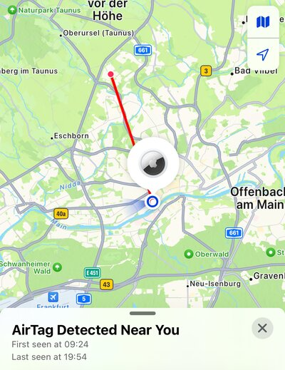
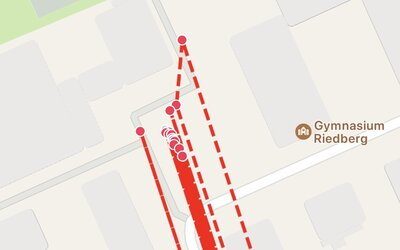
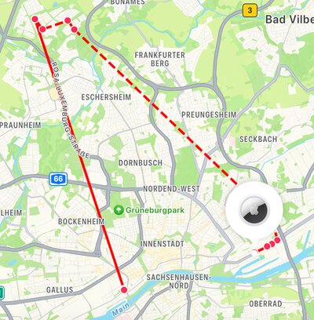

Am Wochenende war Jugend hackt Frankfurt im Jugendhaus Riedberg.
Da WLAN in einem Betonklotz nicht so ganz einfach ist und das bestehende WLAN nicht allzu stabil, wurde ein zusätzliches WLAN mit vielen Accesspoints aufgebaut.
Und das führte zu lustigen Effekten mit AirTags und Eltern.

<!--more-->

Die WLAN Access Points wurden für das verlängerte Wochenende geliehen und sind normalerweise in einem Bürogebäude nahe dem Hauptbahnhof Frankfurt im Einsatz.
Um Energie zu sparen, verwenden Smartphones nicht nur GPS zur Lokalisierung, sondern auch bekannte WLAN Access Points, dessen Position bekannt ist.
In diesem Fall hieß das, dass die Smartphones teilweise annahmen, bei besagtem Bürogebäude in der Nähe des Hauptbahnhofes zu sein.
Aber auch nicht immer.
Manchmal kam die Position dank GPS auch hin.

AirTags verfügen selbst über kein GPS und als Position wird die des letzten Apple Smartphones in der Nähe angenommen.
Wenn ein Smartphone in der Nähe annimmt am Jugendhaus zu sein, wird dies auch für den AirTag angenommen.
Genauso für das Bürogebäude nahe dem Hauptbahnhof.

Ist ein AirTag einige Zeit nicht mit einem Gerät der Besitzer\*in verbunden und bewegt sich mit einem fremden Gerät, so sagt dieses fremde Gerät nach einiger Zeit, das du potenziell gerade von einem AirTag verfolgt wirst.
Ein Mechanismus gegen Stalking.
Bei uns haben sich die Taschen nicht bewegt und waren für den Tag verstaut in einem Raum.
Durch das WLAN gingen die Geräte davon aus, dass sich die AirTags immer mal wieder am Jugendhaus oder in der Nähe des Hbf befinden würden.
Wir bekamen also regelmäßig Hinweise, vielleicht verfolgt zu werden.

In dem Screenshot sind die letzten Punkte, an denen der AirTag in meiner Nähe war, als Historie gelistet.
Dadurch, dass so viele Punkte hin und her springen, überlagern sich die gestrichelten Linien und ergeben eine dicke, durchgezogene Linie.
Hier im Screenshot bin auch ich gerade scheinbar nicht am Veranstaltungsort, sondern in der Innenstadt.
Wenn, wie im folgenden Screenshot dichter herangezoomt wird, sind die einzelnen Punkte und gestrichelten Linien erkennbar. (Spannenderweise sind alle Punkte vor dem Gebäude auf dem Vorplatz, nicht im Gebäude, wo das WLAN ist.)

Als wir abends dann zum Hostel gefahren sind, ist der Sinn des Features leichter ersichtlich.
Die Linie zeigt an welchen Orten der AirTag in meiner Nähe gesichtet wurde und wo das letzte Mal (im Hostel).

So weit ganz lustig.
Dieses Phänomen hat aber auch für verwirrte Eltern gesorgt, wenn ihr Kind nicht am Jugendhaus, sondern in der Innenstadt lokalisiert wurde.
An der Stelle wird es dann spannend, wenn die Annahmen von dem abweichen, was da gerade technisch passiert.

Ich bin für mehr Vertrauen in die eigenen Kinder und Veranstaltende.
Ein weiteres, gutes Beispiel, das soziales nicht unbedingt durch Technik gelöst werden kann.
