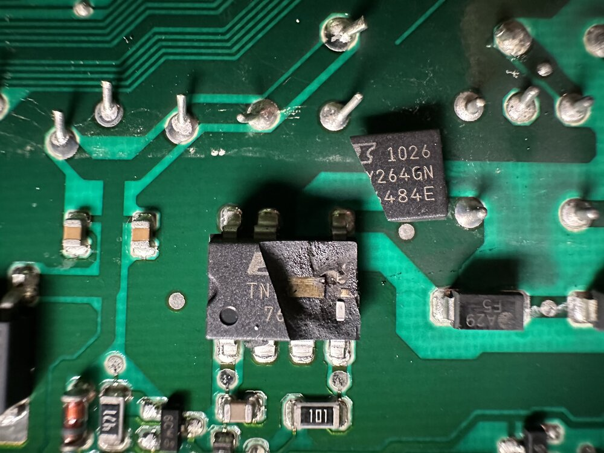
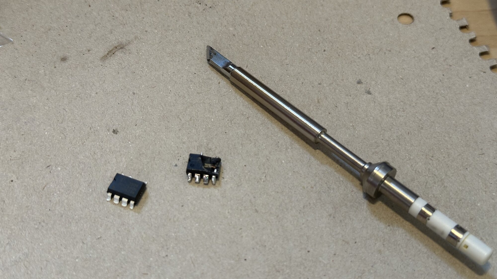
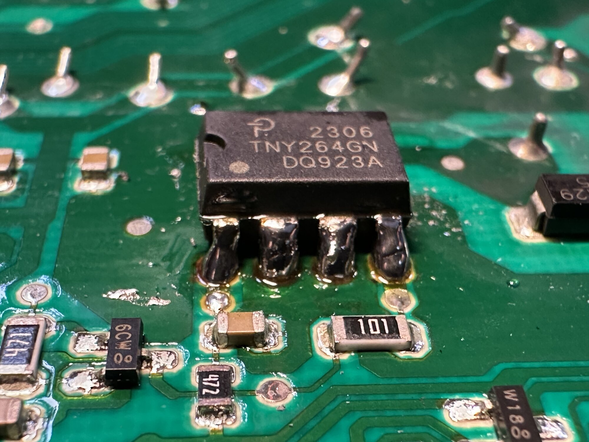

Waschmaschine anstellen und wenn sie geleert werden soll feststellen, die Waschmaschine ist komplett aus, zeigt nichts mehr an, tut nichts mehr.
Unpraktisch.
Vermutlich muss ne neue Waschmaschine her, aber wenn sie eh schon kaputt ist, warum nicht noch mal hereinschauen?

Hauptsächlich will ich mit diesem Blog-Post (auch mich selbst) daran erinnern, das manche Dinge manchmal einfacher reparierbar sind, als vielleicht zuerst erwartet.

<!--more-->

Mechanisch das Wasser ablassen und die Tür öffnen funktionierte noch, aber die gesamte Elektronik tat gar nichts mehr.
Was mich überlegen ließ, ob irgendeine Stromversorgung kaputt ist oder ein Kabel abgegangen.
Wenn das so sein sollte, sollte sich das ja vergleichsweise einfach beheben lassen.
Ein erster Blick hinein ließ erstmal nichts Kaputtes erkennen, nur ein Haufen Kabel in unterschiedliche Richtungen, die alle fest schienen.

Ein Verdacht fiel auf den Kondensator direkt an der Zuleitung, aber ein Messgerät, was das hätte bestätigen können, war nicht zur Hand.
Direkt vom Hersteller gibt es Sprengzeichnungen und alle möglichen (mechanischen) Ersatzteile, auch diesen Kondensator.
Der Kondensator könnte komplett heile sein und müsste erstmal bestellt und getauscht werden, nur um dann potenziell festzustellen, dass dieser nie kaputt war, wirkte wenig erfolgversprechend.

Dafür, dass vom Hersteller unerwartet viele Sprengzeichnungen und mechanische Ersatzteile existieren, gab es fast keine Informationen zu elektrischen Details, geschweige denn den Platinen oder gar Ersatz dafür.
Also Stecker nummeriert, die Verkabelung gelöst und währenddessen einen Haufen Fotos gemacht.
Das meiste hat tatsächlich eindeutige Stecker, die nicht anders passen, aber das Nummerieren stellte sich beim Zusammenbau als relevant heraus.
Nachdem viel der Verkleidung, Kabel und Plastikteile ab waren und die Platine zum Vorschein kam, fiel auf, dass einer der Chips geplatzt war.
In den bereits weggelegten Plastikteilen fand sich auch die klappernde, abgeplatzte obere Hälfte des Chips, mit der glücklicherweise die komplette Aufschrift lesbar wurde.

Im Bild ist der geplatzte Chip und rechts darüber die obere Hälfte zu sehen.
`TNY264GN` stellte sich als Spannungsversorgungschip heraus, was zum Fehlerbild passte.
Offensichtlich kaputt, auslötbar und der Ersatz kostet 1,50 € bei reichelt (+ Versand).

Im Zuge des Auslötens habe ich dann auch das erste Mal eine andere, breite Spitze für meinen Pinecil verwendet.
Bis dahin lagen die nur herum, die Standard-Spitze erfüllte bisher alle Aufgaben gut.

Mit dem Auflöten des neuen Chips war ich nicht komplett zufrieden, das Lötzinn wollte nicht so richtig zur Platine und der Chip ist nicht eben zur Platine (die im Foto hintere, linke Ecke steht höher als der Rest), was ersteres Problem verstärkte.
Dafür hätte ich den Chip noch mal komplett ablöten müssen und wollte die Lötpads oder irgendwas anderes nicht potenziell auch noch mit zu viel Hitze zerstören.

Wirkte gut genug, also mit den Fotos die selbst nummerierten Kabel und Plastikteile wieder zusammengebaut, die Waschmaschine an den Strom gehängt und LEDs und Display gingen an!
2 Sekunden später zeigte dieses allerdings `F:16` auf der Restzeit 7-Segment Anzeige, vermutlich ein Fehlercode.
Wieder etwas demotiviert, da in dem Moment erstmal keine Zeit mehr, aber Fortschritt!

Später ging aus dem Handbuch hervor:

> F16: Einfüllfenster richtig schließen, eventuell Wäsche eingeklemmt.

Das klang harmlos, die Tür stand offen, kein Wunder also.

Seit dem geht die Waschmaschine wieder.

## Fazit

Ich hätte nicht damit gerechnet, vergleichsweise einfach die Waschmaschine wieder zum Laufen zu kriegen.
Wenn ich mir das schlecht reden wollen würde, habe ich durch das Bestellen mehr bestellt, als ich sonst wohl bestellt hätte.
Selbst wenn ich 40 € zum Ausprobieren rechne, bevor es doch eine neue Waschmaschine hätte sein müssen, ist das vergleichsweise günstig zu eben dieser.

Die Lösung für das Problem ist schon recht individuell auf das, was kaputt ist, wird also sehr wahrscheinlich nicht zu anderen kaputten Waschmaschinen passen.
Relevanter als Details zur genauen Reparatur ist für mich eher die Herangehensweise.
Vermutlich lohnt sich wohl ein Blick mehr, bevor etwas Kaputtes weggeschmissen wird.
Und selbst wenns schief gelötet ist oder doch noch kaputter geht, es war eh kaputt, es hätte ausgetauscht werden müssen, es konnte also nur besser werden.
Also mehr Mut, noch mal etwas auszuprobieren, bevor es wirklich als kaputt komplett ersetzt wird?

Und der Vollständigkeit halber: Eine Schraube fehlt jetzt.
